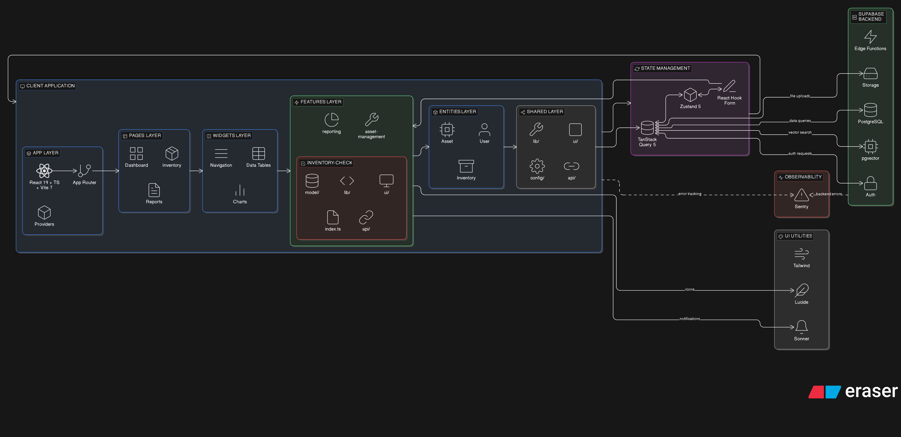

# Trazea

<div align="center">


**Sistema Integral de Gestión de Inventario, Taller y Garantías**

Plataforma web diseñada para Minca Electric que centraliza el control de inventarios multi-sede, solicitudes entre ubicaciones, movimientos de técnicos, garantías de repuestos y seguimiento de órdenes de scooters eléctricos — con trazabilidad completa en cada operación.

[](https://reactjs.org/)
[](https://www.typescriptlang.org/)
[](https://vitejs.dev/)
[](https://tailwindcss.com/)
[](https://supabase.com/)
[](https://feature-sliced.design/)
[](LICENSE)

</div>

---

## ¿Qué es Trazea?

Trazea nace de la necesidad real de Minca Electric de controlar el flujo de repuestos y partes eléctricas entre múltiples sedes de taller. Antes de Trazea, el seguimiento de qué repuesto estaba en qué sede, quién lo solicitó, quién lo despachó y si llegó completo se hacía de forma manual o dispersa en hojas de cálculo.

La plataforma resuelve esto con un sistema donde cada movimiento de inventario queda registrado, cada solicitud pasa por un workflow con trazabilidad completa, y cada garantía se gestiona con evidencia fotográfica y estados claros. Todo accesible desde cualquier dispositivo gracias a su diseño PWA.

---

## Funcionalidades Principales

### 📦 Inventario Multi-Sede

El corazón de la aplicación. Cada sede (localizacion) mantiene su propio inventario con cantidades independientes por repuesto.

- **Stock por ubicación**: cada repuesto tiene su cantidad, posición física en bodega y stock mínimo configurable.
- **Alertas de stock bajo**: cuando un repuesto cae por debajo de su `cantidad_minima`, el sistema genera notificaciones automáticas.
- **Indicador de novedades**: los repuestos recién ingresados se marcan como "nuevos" durante un periodo configurable (`nuevo_hasta`), facilitando la identificación visual de ingresos recientes.
- **Logs de auditoría**: cada cambio de cantidad queda registrado en `logs_inventario` con el usuario responsable, cantidad anterior, cantidad nueva, tipo de operación y detalles. Nada se pierde.
- **Conteo de verificación**: el campo `veces_contado` permite rastrear cuántas veces un ítem ha sido auditado físicamente.

### 🔄 Solicitudes entre Sedes (Workflow Completo)

El flujo de solicitudes es uno de los procesos más robustos del sistema. Una solicitud pasa por múltiples etapas, cada una con un responsable diferente:

1. **Creación**: un usuario en la sede destino crea la solicitud seleccionando repuestos desde un carrito (`carrito_solicitudes`).
2. **Alistamiento**: el almacenista de la sede origen prepara los ítems, registrando la `cantidad_despachada` por cada repuesto (puede diferir de la solicitada).
3. **Despacho**: se registra la guía de transporte y la fecha de envío.
4. **Recepción**: el receptor en destino confirma la `cantidad_recibida` por ítem y puede agregar observaciones individuales.

Cada transición de estado queda registrada en `trazabilidad_solicitudes` con el estado anterior, el nuevo, quién hizo el cambio, la fecha y un comentario opcional. Esto permite reconstruir el historial completo de cualquier solicitud.

El sistema de carrito permite a los usuarios agregar múltiples repuestos con cantidades específicas antes de generar la solicitud formal, haciendo el proceso más ágil que crear solicitudes ítem por ítem.

### 🔧 Movimientos de Técnicos

Los técnicos de taller generan movimientos de repuestos diariamente (carga y descarga de partes para reparaciones). El sistema registra:

- **Concepto y tipo** del movimiento (carga/descarga).
- **Número de orden** de trabajo asociada.
- **Técnico asignado** y usuario responsable (pueden ser diferentes — un supervisor puede registrar el movimiento de un técnico).
- **Estado de descarga**: el flag `descargada` permite rastrear si un movimiento de carga ya fue descontado del inventario.

Esto permite saber exactamente qué repuestos tiene asignados cada técnico y cruzar esa información con el inventario físico.

### 🛡️ Gestión de Garantías

Cuando un repuesto falla, el sistema permite registrar la garantía con toda la información necesaria para el reclamo:

- **Datos del repuesto**: referencia, nombre, cantidad afectada.
- **Contexto de la falla**: motivo de falla en texto libre, kilometraje del scooter, número de orden de trabajo y solicitante.
- **Evidencia**: URL de foto como respaldo visual del defecto.
- **Flujo de estados**: `Sin enviar` → `Pendiente` → `Aprobada` / `Rechazada`, con comentarios de resolución.
- **Asociación a técnico**: se registra tanto quién reporta la garantía como el técnico asociado al caso.

### 📊 Conteo Físico (Auditoría de Inventario)

El módulo de conteo permite realizar auditorías de inventario comparando el stock del sistema con el conteo físico real:

- **Conteo total o parcial**: se puede auditar toda la bodega o solo un subconjunto de repuestos.
- **Tres cantidades por ítem**: cantidad del sistema, cantidad contada en sede (CSA) y cantidad en "pequeños quedan" (PQ) — esas piezas sueltas o en proceso que suelen generar discrepancias.
- **Diferencia automática**: calculada como `(cantidad_sistema + cantidad_pq) - cantidad_csa`.
- **Resumen del conteo**: total de ítems auditados, total de diferencias encontradas e ítems con PQ.
- **Exportación a Excel**: generación de reportes con las discrepancias para acción correctiva.

### 🛵 Seguimiento de Órdenes de Scooters

Un módulo específico para el negocio de scooters eléctricos de Minca Electric:

- **Seguimiento por niveles** (1 a 3): progreso del pedido desde la orden hasta la entrega.
- **Tipo de scooter**: asociado a un catálogo de tipos con especificaciones de potencia.
- **Datos de contacto**: teléfono y email del cliente para comunicación directa.
- **Link de orden y estado**: permite al equipo consultar el estado actualizado de cada pedido.

### 🔔 Sistema de Notificaciones

- **Notificaciones in-app**: con título, mensaje, tipo, prioridad (alta/media/baja) y estado de lectura.
- **Segmentación**: por usuario específico o por ubicación (todos los usuarios de una sede).
- **Datos adicionales**: campo JSON flexible para adjuntar metadata contextual.
- **Notificaciones admin**: los administradores pueden suscribirse para recibir alertas de nuevos registros de usuarios.

### 👥 Gestión de Usuarios y Acceso

El sistema implementa un flujo de registro con aprobación:

- **Registro con aprobación**: los nuevos usuarios quedan en estado `aprobado = false` hasta que un administrador los aprueba. Se registra quién aprobó, cuándo y, en caso de rechazo, el motivo.
- **Roles con permisos granulares**: cada rol tiene un objeto JSON de permisos que define exactamente qué puede hacer cada perfil en el sistema.
- **Asignación multi-sede**: un usuario puede estar asignado a una o más ubicaciones mediante `usuarios_localizacion`, controlando a qué inventarios tiene acceso.
- **Autenticación**: integración con Supabase Auth (email/password y Google OAuth).

### 📋 Catálogo de Repuestos

Base de datos centralizada de todos los repuestos del negocio:

- **Referencia única**: código identificador que se usa en todo el sistema.
- **Clasificación**: tipo, marca y descripción detallada.
- **Estado**: flag de descontinuado para repuestos que ya no se manejan.
- **Fecha estimada**: para repuestos en espera de reposición.
- **Imágenes**: URL de imagen del repuesto para identificación visual.
- **Carga masiva**: importación desde archivos Excel para actualizaciones grandes del catálogo.

---

## Arquitectura

### Feature-Sliced Design (FSD)

El proyecto implementa FSD como metodología arquitectónica, organizando el código en capas con responsabilidades claras y dependencias unidireccionales:


[View on Eraser](https://app.eraser.io/workspace/2ZDcv2JJh3kFqiyUbmXW?diagram=MiwqNinJuT_PnLntEwHew)

```
src/
├── app/          → Configuración global, routing, providers, Sentry
├── pages/        → Composición de features en vistas completas
├── widgets/      → Componentes compuestos reutilizables (nav, notifications, pagination)
├── features/     → Casos de uso del usuario (crear repuesto, solicitar, contar)
├── entities/     → Entidades de dominio (user, inventory, locations)
├── shared/       → UI base, utilidades, tipos, helpers
└── processes/    → Flujos de datos entre features
```

Cada feature sigue una estructura interna consistente:

```
features/nombre-feature/
├── ui/           → Componentes de presentación
├── model/        → Tipos, validaciones (Zod), estado (Zustand)
├── lib/          → Lógica de negocio
├── api/          → Llamadas a Supabase
└── index.ts      → API pública del feature
```

### Stack Técnico

| Capa | Tecnología | Propósito |
|------|-----------|-----------|
| **UI** | React 19 + TypeScript | Componentes tipados con hooks |
| **Estilos** | Tailwind CSS 4 + Radix UI | Utility-first + componentes accesibles |
| **Estado cliente** | Zustand 5 | Estado global ligero y reactivo |
| **Estado servidor** | TanStack Query 5 | Cache, sincronización y refetch automático |
| **Formularios** | React Hook Form + Zod | Validación declarativa con inferencia de tipos |
| **Backend** | Supabase | Auth, PostgreSQL, Storage, Row Level Security |
| **Build** | Vite 7 | HMR instantáneo y builds optimizados |
| **Monitoreo** | Sentry 10 | Error tracking en producción |
| **Notificaciones** | Sonner | Toast notifications no intrusivas |
| **Iconos** | Lucide React | Iconografía consistente y ligera |

---

## Estructura del Proyecto

```
trazea/
├── public/                    → Assets estáticos (logos, favicon)
├── src/
│   ├── app/
│   │   ├── ui/               → App root y routing principal
│   │   ├── providers/        → Auth, Query, Theme providers
│   │   ├── styles/           → CSS global y configuración Tailwind
│   │   └── lib/              → Cliente Supabase, configuración Sentry
│   ├── entities/
│   │   ├── user/             → Autenticación, roles, perfil
│   │   ├── locations/        → Sedes y asignaciones
│   │   └── inventory/        → Tipos de inventario y repuestos
│   ├── features/
│   │   ├── auth-login/       → Login (email + Google OAuth)
│   │   ├── spares-create/    → CRUD de repuestos
│   │   ├── spares-upload/    → Carga masiva desde Excel
│   │   ├── spares-request-workshop/ → Solicitudes con carrito
│   │   ├── guarantees-create/ → Registro de garantías
│   │   └── count-spares/     → Conteo físico de inventario
│   ├── pages/
│   │   ├── auth/             → Login, registro, aprobación pendiente
│   │   ├── inventario/       → Vista y gestión de stock por sede
│   │   ├── spares/           → Catálogo de repuestos
│   │   ├── orders/           → Seguimiento de órdenes de scooters
│   │   ├── records/          → Movimientos, garantías, historial
│   │   ├── count/            → Módulo de conteo físico
│   │   └── dynamo/           → Página Dynamo (scooters)
│   ├── widgets/
│   │   ├── nav/              → Sidebar y navegación principal
│   │   ├── notifications/    → Centro de notificaciones
│   │   └── pagination/       → Paginación genérica
│   ├── shared/
│   │   ├── ui/               → Botones, inputs, modales, badges
│   │   ├── lib/              → Utilidades, formateo, constantes
│   │   └── components/       → Componentes compartidos
│   └── assets/               → Imágenes y recursos internos
├── docker-compose.yml
├── Dockerfile
├── vite.config.ts
└── tsconfig.json
```

---

## Configuración e Instalación

### Requisitos

- Node.js 22+
- pnpm (recomendado)

### Variables de Entorno

```env
VITE_SUPABASE_URL=https://tu-proyecto.supabase.co
VITE_SUPABASE_ANON_KEY=tu-anon-key
VITE_SENTRY_DSN=https://tu-dsn@sentry.io/project-id
```

### Ejecución Local

```bash
# Clonar e instalar
git clone <repository-url>
cd trazea
pnpm install

# Configurar entorno
cp .env.example .env
# Editar .env con tus credenciales

# Iniciar en desarrollo (http://localhost:5173)
pnpm dev
```

### Scripts Disponibles

```bash
pnpm dev          # Desarrollo con HMR
pnpm build        # Build de producción
pnpm preview      # Preview del build
pnpm lint         # Linting
pnpm test         # Tests con Vitest
pnpm test:watch   # Tests en modo watch
pnpm test:coverage # Cobertura de código
```

### Docker

```bash
# Desarrollo
docker-compose up --build

# Producción
docker build -t trazea:latest .
docker run -p 80:80 trazea:latest
```

---

## Modelo de Datos

El sistema se compone de 17 tablas principales organizadas en estos dominios:

```
┌─────────────────────────────────────────────────────────────┐
│                     USUARIOS Y ACCESO                       │
│  usuarios ←→ roles         (permisos JSON por rol)          │
│  usuarios ←→ localizacion  (asignación multi-sede)          │
│  admin_notifications       (suscripción a alertas)          │
└─────────────────────────────────────────────────────────────┘
                            │
        ┌───────────────────┼───────────────────┐
        ▼                   ▼                   ▼
┌───────────────┐  ┌────────────────┐  ┌────────────────────┐
│  INVENTARIO   │  │  SOLICITUDES   │  │    GARANTÍAS       │
│               │  │                │  │                    │
│ inventario    │  │ carrito        │  │ garantias          │
│ repuestos     │  │ solicitudes    │  │ (estados, fotos,   │
│ logs          │  │ detalles       │  │  km, técnico)      │
│ movimientos   │  │ trazabilidad   │  └────────────────────┘
│  técnicos     │  └────────────────┘
└───────────────┘          │
                    ┌──────────────────────────┐
                    │  CONTEO / AUDITORÍA       │
                    │  registro_conteo          │
                    │  detalles_conteo          │
                    │  (sistema vs físico vs PQ)│
                    └──────────────────────────┘

┌─────────────────────────────────────────────────────────────┐
│                   SCOOTERS Y ÓRDENES                        │
│  scooter_types → order_follow  (seguimiento por niveles)    │
└─────────────────────────────────────────────────────────────┘
```

---

## Despliegue

### Vercel (Recomendado)

1. Conectar el repositorio a Vercel.
2. Configurar las variables de entorno en el dashboard.
3. Deploy automático en cada push a `main`.

### Configuración de Producción

- Habilitar HTTPS/SSL.
- Configurar CORS en Supabase con los orígenes permitidos.
- Verificar que Row Level Security esté activo en todas las tablas.
- Sentry configurado para error tracking automático.

---

## Desarrollo

### Convenciones

- TypeScript estricto en todo el código.
- Componentes funcionales con hooks.
- Tailwind CSS como sistema de estilos principal.
- Validación de formularios con Zod.
- Manejo de estado servidor con TanStack Query.

### Branching

```
main       → producción
develop    → desarrollo
feature/*  → nuevas funcionalidades
hotfix/*   → correcciones urgentes
```

### Commits

```
feat: nueva funcionalidad
fix: corrección de bug
docs: documentación
refactor: refactorización
test: pruebas
chore: dependencias/configuración
```

---

## Licencia

MIT License — Copyright (c) 2024 Oscar Casas

---

<div align="center">

**Desarrollado con ❤️ por Oscar Casas**

[](https://reactjs.org/)
[](https://feature-sliced.design/)
[](https://supabase.com/)

</div>